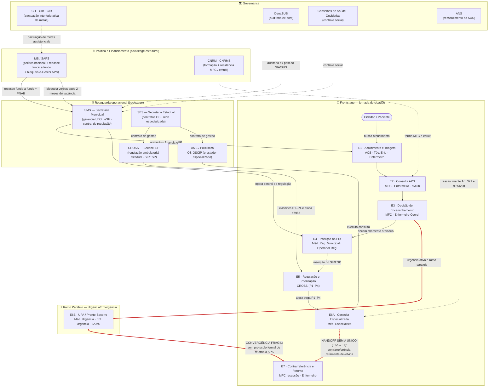

# Mapa de Atores — Jornada de Consulta Médica no SUS

> Artefato da Parte C do Exercício 2.1. Destila a pesquisa adversária
> (`B_relatorio_auditoria_v3.md`) em um mapa **decidido** via sessão `/grill-me`
> (ver `C_grill_transcript.md`). Segue as boas práticas da Aula 02 (Passo 0 → Passo 5).

---

## Passo 0 — Propósito do mapa

**Endereçar o déficit estrutural de cobertura assistencial e a descontinuidade do
cuidado na jornada de consulta médica no SUS**, originados em dois pontos de ruptura
sobrepostos: (1) a **vacância médica na eSF** que reduz a cobertura real para 0,63
consultas/hab./ano — 42% da meta indicativa de 1,5 — e (2) a **ausência de
accountability único no handoff E6A→E7**, em que a contrarreferência raramente
retorna ao médico de família, perpetuando encaminhamentos redundantes e *failure
demand* no nível especializado.

O mapa não é um inventário completo do SUS (financiamento constitucional, habilitação
de leitos hospitalares e judicialização de segunda instância ficaram **fora de escopo**
por decisão de altitude). Ele é **jornada-cêntrico**: detalha quem participa das
etapas **E1–E7** — do primeiro contato na APS até o retorno por contrarreferência —
e a retaguarda que **gera os gargalos de acesso**. *(grill Q1)*

---

## Passo 4 — Mapa de relações (jornada + handoffs + fluxo de dados)

Três camadas: (1) o **fluxo da jornada do cidadão**; (2) os **handoffs críticos** —
E6A→E7 em **vermelho** (contrarreferência sem A único) e E6B→E7 como convergência
frágil; (3) o **fluxo de dados e políticas a montante** que condiciona a disponibilidade
de médicos e vagas. Governança (controle/auditoria) entra como setas tracejadas.

> **Leitura do diagrama.** A ligação do cidadão à rede especializada depende de dois
> fluxos a montante invisíveis para ele: o repasse fundo a fundo MS→SMS (que determina
> se a eSF está completa ou em vacância) e o contrato de gestão SES→CROSS (que
> determina a velocidade de alocação de vagas). O handoff E6A→E7 não tem nenhum ator
> **Aprovador (A) único** da experiência ponta-a-ponta: a SMS fecha o caso regulatório,
> a OS fecha a produção de consultas, e **ninguém** é A do retorno clínico ao médico de
> família. É a violação do **agnosticismo organizacional** (Princípio #5, Lou Downe)
> que materializa a *failure demand* de encaminhamentos redundantes.

---

## Tabela de atores — RACI por etapa + categoria × palco *(grill Q8)*

**Etapas da jornada:**
**E1** Acolhimento e Triagem ·
**E2** Consulta APS ·
**E3** Decisão de Encaminhamento ·
**E4** Inserção na Fila (SIRESP/SISREG) ·
**E5** Regulação e Priorização (CROSS) ·
**E6A** Consulta Especializada ·
**E6B** Urgência/Emergência *(ramo paralelo)* ·
**E7** Contrarreferência e Retorno.

**RACI:** **R** = executa · **A** = responde/aprova (*accountable*) · **C** = consultado · **I** = informado. Cada ator é anotado com nome, papel e ponto de fricção principal; âncoras normativas registradas como metadado em tabela de apoio. *(grill Q6)*

| # | Ator | Categoria | Palco | Etapa(s) RACI | Entra na jornada | Sai da jornada | Poder | Interesse |
|---|------|-----------|-------|---------------|------------------|----------------|-------|-----------|
| 1 | **Cidadão / Paciente** | Usuário direto | front | E1:**R** · E2:**R** · E3:**I** · E4:**I** · E5:**I** · E6A/B:**R** · E7:**R** | E1 (busca atendimento espontâneo) | E7 idealizado; na prática, abandono ou judicialização | Baixo | Alto |
| 2 | **ACS** | Operador | front | E1:**R** · E2:**C** · E7:**I** | E1 (captação territorial) | E1 (não acompanha etapas regulatórias) | Baixo | Alto |
| 3 | **Técnico/Auxiliar de Enfermagem** | Operador | front | E1:**R** · E2:**C** · E6A:**R** · E6B:**R** | E1 (recepção e pré-consulta) | E6A/E6B (não segue para E7) | Baixo | Médio |
| 4 | **Enfermeiro** | Operador | front | E1:**R** · E2:**R** · E3:**R** · E7:**R** | E1 (classificação de risco) | E7 (coordena retorno) | Médio | Alto |
| 5 | **Médico de Família e Comunidade (MFC)** | Operador/Decisor | front | E2:**R/A** · E3:**R/A** · E7:**R/A** | E2 (consulta clínica) | E7 (fecha o ciclo — quando acontece) | Médio | Alto |
| 6 | **eMulti** | Operador | front | E2:**R** · E3:**C** | E2 (apoio matricial, teleconsultoria) | E3 (não acompanha etapas regulatórias) | Baixo | Alto |
| 7 | **Médico Regulador Municipal** | Gestor/Decisor | front (regulação) | E4:**R/A** | E4 (valida e prioriza encaminhamentos) | E4 (encaminha ao SIRESP) | Médio | Alto |
| 8 | **Operador de Regulação Municipal** | Operador | front (regulação) | E4:**R** | E4 (inserção de dados no SIRESP) | E4 | Baixo | Médio |
| 9 | **CROSS / Seconci-SP** *(ator institucional)* | OS — Ator institucional | back (regulação estadual) | E5:**R/A** | E5 (recebe solicitação do SIRESP) | E5 (após alocação de vaga) | Alto | Alto |
| 10 | **Médico Especialista** | Operador/Decisor | front | E6A:**R/A** · E7:**R** | E6A (consulta especializada) | E7 — deveria; na prática encerra em E6A sem contrarreferência | Médio | Alto |
| 11 | **Médico de Urgência/Emergência** | Operador | front | E6B:**R** | E6B (atendimento de urgência) | E6B (raramente formaliza retorno à APS) | Médio | Alto |
| 12 | **SAMU** | Operador | front | E6B:**R** | E6B (transporte pré-hospitalar) | E6B (após transferência para unidade) | Médio | Médio |
| 13 | **Secretaria Municipal de Saúde (SMS)** | Gestor/Decisor | back | E1:**A** · E2:**A** · E3:**A** · E4:**A** · E7:**A** | Permanente | — | Alto | Alto |
| 14 | **AME / Policlínica / OS-OSCIP** | Prestador | back (executa no front) | E6A:**R/A** | E6A (executa consulta sob contrato) | E6A — deveria manter A até E7 | Alto | Alto |
| 15 | **UPA / Pronto-Socorro** | Prestador | back (executa no front) | E6B:**R/A** | E6B (atendimento de urgência) | E6B (sem protocolo de retorno à APS) | Médio | Alto |
| 16 | **Secretaria Estadual de Saúde (SES)** | Gestor/Decisor | back | E5:**A** · E6A:**A** · E6B:**A** | E5 (gestão da rede especializada) | — | Alto | Alto |
| 17 | **Ministério da Saúde / SAPS** | Gestor/Normatizador | back | E1–E7:**A** *(política e financiamento)* | Permanente | — | Alto | Alto |
| 18 | **CIT · CIB · CIR** | Instância de pactuação interfederativa | governança | E1–E7:**C** | Permanente | — | Alto | Médio |
| 19 | **Conselhos de Saúde** | Controle social | governança | E1–E7:**C** | Permanente | — | Médio | Alto |
| 20 | **DenaSUS** | Controle interno | governança | E1–E7:**C** *(episódico)* | Episódico (auditoria) | — | Alto | Baixo |
| 21 | **ANS** | Regulador | governança | E6A:**C** *(quando há beneficiário de plano)* | E6A (ressarcimento) | — | Médio | Baixo |
| 22 | **Ouvidorias** | Controle social | governança | E1–E7:**I/C** | Permanente | — | Baixo | Alto |
| 23 | **CNRM · CNRMS · Inst. Formadoras** | Formação profissional | back (estrutural) | E2:**C** *(formação de MFC e eMulti)* | Estrutural (pré-jornada) | — | Médio | Baixo |

> **Achado RACI.** A coluna **A** está ausente no handoff **E6A→E7**: o Médico
> Especialista é **R** da consulta (E6A), mas nenhum ator é **A** de garantir que a
> contrarreferência chegue ao MFC (E7). A SMS fecha o caso regulatório (A de E7) sem
> verificar o fechamento clínico. A AME/OS-OSCIP é A de E6A, não de E7. O resultado é
> um **"E7 fantasma"**: o processo regulatório encerra, mas o loop clínico permanece
> aberto em mais de 80% dos casos na prática — exatamente o que gera os encaminhamentos
> redundantes de *failure demand* de volta ao E4.

---

## Passo 5 — Atores-chave e hipóteses de diagnóstico

Atores com poder de bloquear ou viabilizar a mudança: **MFC/eSF (5), SMS (13),
CROSS/Seconci-SP (9), AME/OS-OSCIP (14), SES (16), MS/SAPS (17), DenaSUS (20),
Conselhos de Saúde (19)** e o **Cidadão (1)** como voz coletiva (via Conselhos e
ouvidorias).

**H1 (central) — A ausência de A único no handoff E6A→E7 institucionaliza a
descontinuidade do cuidado como *default* operacional.**
Atores que sustentam o status quo: AME/OS-OSCIP (contrato sem obrigação de
contrarreferência), Médico Especialista (não penalizado por omissão), SMS (fecha
caso regulatório sem verificar fechamento clínico). *Evidência:* taxa de
contrarreferência próxima de zero na prática; MFC atende o mesmo paciente
repetidamente sem contexto especializado; ciclo de encaminhamentos redundantes
retornando ao E4 — *failure demand* estrutural no nível especializado.

**H2 — A vacância médica na eSF não é apenas problema de provimento: é problema de
incentivos não resolvidos entre E2 e o backstage (MS/SAPS).**
O bloqueio automático de verbas pelo e-Gestor APS após 2 meses de vacância pune
o município sem resolver a causa raiz (atração e fixação de MFC). Cobertura real
de 0,63/hab./ano = 42% da meta indicativa de 1,5; o déficit de 57,8% origina-se
em E2 e propaga-se para todas as etapas seguintes. O CNRM concentra vagas de
residência em grandes centros — o backstage de formação não alimenta os vazios
assistenciais.

**H3 — A fragmentação do SIRESP por unidade solicitante mantém a demanda reprimida
politicamente opaca (E4).**
A SMS não tem visão agregada da fila municipal, o que protege gestores de cobrança
política mas impede planejamento baseado em dados. A experiência de Campinas/SP
(mai/2024) demonstra que a unificação é tecnicamente viável; o que falta é
vontade de tornar o problema visível ao controle social e às CIR.

**H4 — O contrato de gestão da CROSS (SES/Seconci-SP) não está orientado a
*throughput* nem a tempo de espera por especialidade (E5).**
Com repasse global garantido sem vínculo a indicadores de desempenho, a CROSS
opera como classificador de prioridades (P1–P4) sem incentivo sistêmico para
reduzir a fila — apenas para organizá-la. O modelo de contratação é o mesmo
problema de H1 em outra etapa.

**H5 — Os contratos das OS/OSCIP prestadoras de consultas especializadas medem
produção sem exigir FCR ou contrarreferência, completando o ciclo de *failure
demand* (E6A→E7).**
A AME/OS-OSCIP é remunerada por consulta realizada. Absenteísmo não é penalizado.
Contrarreferência não é requisito contratual. O MFC nunca fecha o loop — e o
mesmo paciente volta ao E4, ampliando a fila que H3 já mantém opaca.

> **Fora de escopo (jornada-cêntrico):** H6 (judicialização individual via
> Defensoria) e H7 (ressarcimento ANS subutilizado) são diagnósticos válidos do
> `B_relatorio_auditoria_v3.md`, mas puxam para atores fora do recorte da jornada
> ordinária de consulta.

---

## Vozes Críticas

- **DenaSUS** *(ator 20, já no roster)* — voz crítica mais consistente via relatórios
  de auditoria sobre metas físicas e financeiras; dados do SIA/SUS com defasagem
  limitam tempestividade dos achados.
- **Conselhos de Saúde** *(ator 19)* — participação formal existe; o problema é a
  ausência de capacidade técnica analítica para monitorar indicadores do SIRESP e
  do e-Gestor APS. A ausência de controle social efetivo sobre dados de cobertura
  é, ela mesma, um achado.
- **Ouvidorias** *(ator 22)* — padrão recorrente de reclamações sobre filas, ausência
  de contrarreferência e absenteísmo: *intelligence* diagnóstica sistematicamente
  subutilizada pela gestão.
- **TCU / CGU / Ministério Público** *(fora do roster — vozes críticas externas)* —
  não incluídos como atores operacionais da jornada por decisão de altitude, mas
  com poder de redesenhar o serviço via acórdão ou ação civil pública. O Tema 698
  do STF (RE 684.612/RJ, jul/2023) já fixou que intervenção judicial em políticas
  de saúde é legítima diante de inércia ou deficiência grave. A ausência de metas
  vinculantes de contrarreferência nos contratos de gestão OS é o tipo de achado
  que TCU pode converter em determinação vinculante overnight.
- **LACUNA DE CONTROLE SOCIAL DIGITAL (achado).** Não se localizou iniciativa
  sistemática de organizações como Transparência Brasil, Open Knowledge Brasil ou
  Fiquem Sabendo sobre monitoramento público das filas do SIRESP ou dos contratos
  de gestão das OS de saúde. **A ausência é, ela mesma, um achado** — reforça H3
  (opacidade da demanda reprimida): o principal instrumento de regulação do acesso
  ambulatorial paulista não tem fiscalização da sociedade civil organizada.

---

## Decisões tomadas durante o grill que motivam as escolhas do mapa

As 8 decisões abaixo foram tomadas durante a sessão `/grill-me`
(ver `C_grill_transcript.md`) e motivaram diretamente as escolhas estruturais deste mapa.

1. **Escopo end-to-end (E1→E7)** — Decisão tomada durante o grill (Q1) motivou
   cobrir a jornada completa desde o primeiro contato na APS até a contrarreferência,
   em vez de recorte parcial na fila SIRESP/CROSS. O gap de 42,2% tem determinantes
   em múltiplas etapas; restringir ao SIRESP teria ocultado causas a montante e a
   jusante. *(grill Q1)*

2. **Estrutura linear** (posição na jornada) em vez de concêntrica — Decisão tomada
   durante o grill (Q2) motivou organizar os atores por etapa de jornada, evidenciando
   os handoffs E3→E4, E5→E6A e sobretudo E6A→E7 onde a accountability se fragmenta
   e onde mora o principal achado RACI deste mapa. *(grill Q2)*

3. **Urgência como ramo paralelo (E6B)** — Decisão tomada durante o grill (Q3) motivou
   não colapsar E6A e E6B numa mesma coluna, tornando visível que a convergência em E7
   é frágil em ambos os fluxos e que a urgência tem dinâmica própria (superlotação por
   demanda que deveria ter sido resolvida na APS). *(grill Q3)*

4. **CROSS/SIRESP como ator institucional; demais sistemas como artefatos** — Decisão
   tomada durante o grill (Q4) motivou tratar a CROSS (OS Seconci-SP com contrato de
   gestão próprio) como ator com accountability, e anotar e-SUS, RNDS, SIA/SUS e
   e-Gestor APS como ferramentas nos atores que os operam. *(grill Q4)*

5. **Faixa backstage horizontal com 3 sub-linhas** — Decisão tomada durante o grill
   (Q5) motivou separar as causas operacionais (linha de frente) das causas estruturais
   (gestão/financiamento, controle/auditoria, formação/provimento), revelando que o
   déficit de 57,8% não pode ser resolvido só pela linha de frente. *(grill Q5)*

6. **Anotação: Nome + Papel + Ponto de fricção principal** — Decisão tomada durante o
   grill (Q6) motivou anotar cada ator com nome, papel e seu principal gargalo, deixando
   âncoras normativas em tabela de apoio e alavancas de melhoria em artefato
   complementar, para manter o mapa diagnóstico sem tornar-se prescritivo. *(grill Q6)*

7. **Cidadão como sujeito da jornada** — Decisão tomada durante o grill (Q7) motivou
   posicionar o cidadão em faixa horizontal própria no topo, não como ator operacional
   equiparado a médicos e gestores: seus pontos de fricção por etapa são o termômetro
   do serviço. *(grill Q7)*

8. **Formato: tabela markdown + glossário de atores** — Decisão tomada durante o grill
   (Q8) motivou adotar tabela RACI para visão sintética mais glossário de atores para
   profundidade analítica, em vez de narrativa por etapa ou tabela isolada. *(grill Q8)*

---

*Mapa derivado de `B_relatorio_auditoria_v3.md` (pesquisa adversária, 3 rodadas de
auditoria) e decidido na sessão `/grill-me` registrada em `C_grill_transcript.md`.
